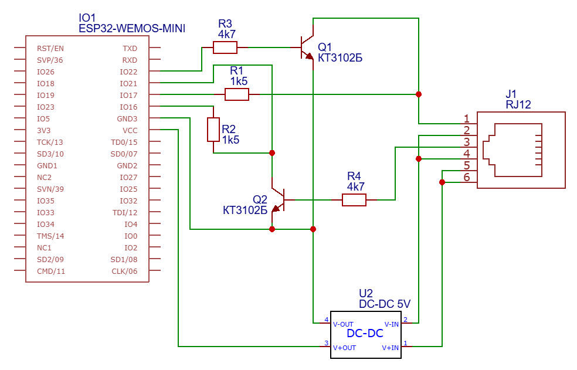

# Tech_RS-mqtt-gateway
Tech is a producer of heat system controllers from Poland. Some of controllers are embedded with RS communication port.
This one ESP32 based gateway read parameters of heating system and transmit them via MQTT broker.
Afteward that data can be used with Home Assistant integrations.

The project is based on information from the Elektroda forum https://www.elektroda.pl/rtvforum/topic2689981-180.html
The main part of class 'CTechManager' is developed by @rapit79 from the forum discussion.

# Used modules

* Any ESP32 microcontroller.
* BC547 transistors. There are many alternatives, such as russian КТ3102
* DC-DC step down module for transforming ~15V from Tech controller to the 5V for ESP32 supply.
* RJ12 connector

# Some features

* Auto-discovery is used for automatic configuration of sensor in HomeAssistant and grouping them in a single device entity
* sntp client allows to generate device clock data in the ISO 8601 format.
* device clock syncronisation is implemented. However it doesn't work at least on my ST-408.
* Serial3 for communication with Tech controller. Which keeps Serial1 available for diagnostic/troubleshooting and skips Serial2 as a non-usable on many ESP32 boards.

